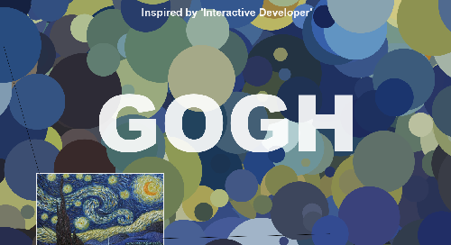
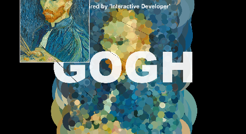
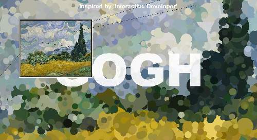

# Duplication

A project to show how many animation effects can be shown in HTML5. This project is packaged as a library with webpack to reuse more easier.

After selecting a random pixel in the picture, it is drawn as a circle of random size on the background.

This project was inspired by YouTuber `Interactive Developer`, but all architecture and code was implemented by me.

This video is under this link: https://youtu.be/d8Yad0bmaPk

## How to use

Write a url or a url list of the image in the constructor of `DuplicateDraw` and call animate on this instance recursively with `window.requestAnimationFrame()`.

```js
const imgUrls = ['./imgs/gogh1.jpg', './imgs/gogh2.jpg', './imgs/gogh3.jpg'];
const duplicateDraw = new DuplicateDraw(url);
duplicateDraw.resize();
window.requestAnimationFrame(animate);

function animate(curTime) {
  duplicateDraw.animate(curTime);
  window.requestAnimationFrame(animate);
}
```

## Used tools

- HTML5
- CSS3
- JavaScript

## Overview

  
  
  

## Page

https://tokenkim92.github.io/Duplication/
